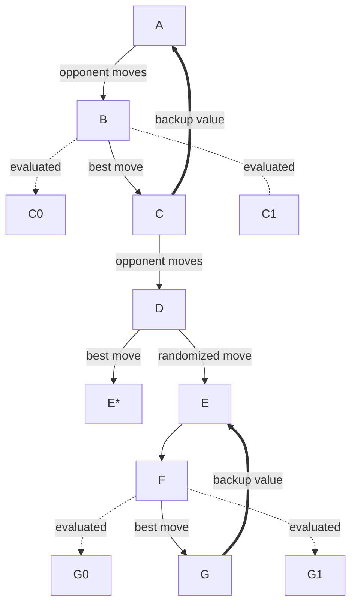
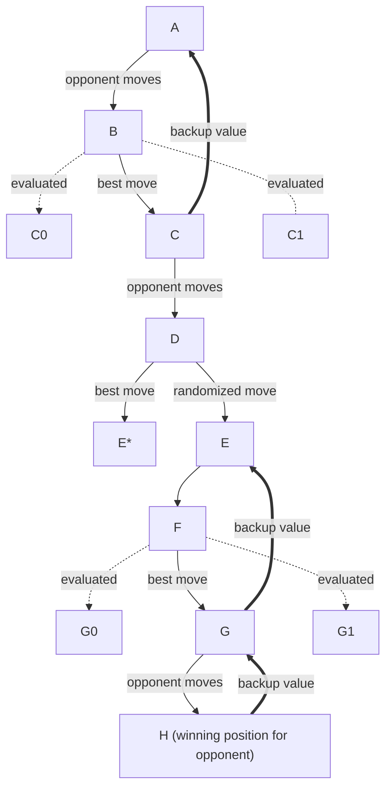

A couple of weeks ago I wanted to take a look at reinforcement learning and possibly work on a very simple sample in C#. In search for a book to learn some basics I found [**Reinforcement Learning: An Introduction**](http://incompleteideas.net/book/the-book-2nd.html) suggested in multiple places. The book is available for free as a PDF on the linked website, so I thought it would be a good starting point.

The book offers in the very first chapter, a tic-tac-toe example where an algorithm is described, albeit with not too much details. I decided to try to implement a C# version of that. Plenty of implementations are available online and the authors offer a `lisp` version on their website, so there is a wide range of option to explore and evaluate.

<!-- truncate -->

I will report part of the text of the example here to comment on it and provide some additional details that I think would helped me in understanding the example. In short the objective of the exercise is to implement a player, `QPlayer` in my case, that plays the `X` symbol and decides what move to play based on a function that assigns a value to each state of the game. This value function will be improved iteratively by making the `QPlayer` play against another automated player. The state of the game is a possible configuration of `X` and `O` on the 3x3 grid. The value function is a function that assigns a double value to each state of the game.

From the book:

> Here is how the tic-tac-toe problem would be approached with a method
making use of a value function. First we set up a table of numbers, one for
each possible state of the game. Each number will be the latest estimate of
the probability of our winning from that state. We treat this estimate as the
state’s value, and the whole table is the learned value function. State A has
higher value than state B, or is considered “better” than state B, if the current
estimate of the probability of our winning from A is higher than it is from B.
Assuming we always play Xs, then for all states with three Xs in a row the
probability of winning is 1, because we have already won. Similarly, for all
states with three Os in a row, or that are “filled up,” the correct probability
is 0, as we cannot win from them. We set the initial values of all the other
states to 0.5, representing a guess that we have a 50% chance of winning.
We play many games against the opponent. To select our moves we examine
the states that would result from each of our possible moves (one for each blank
space on the board) and look up their current values in the table. Most of the
time we move greedily, selecting the move that leads to the state with greatest
value, that is, with the highest estimated probability of winning. Occasionally,
however, we select randomly from among the other moves instead. These are
called exploratory moves because they cause us to experience states that we
might otherwise never see.
While we are playing, we change the values of the states in which we find
ourselves during the game. We attempt to make them more accurate estimates
of the probabilities of winning. To do this, we “back up” the value of the state
after each greedy move to the state before the move [...]. More precisely, the current value of the earlier state is adjusted
to be closer to the value of the later state. This can be done by moving the
earlier state’s value a fraction of the way toward the value of the later state.
If we let s denote the state before the greedy move, and s' the state after
the move, then the update to the estimated value of s, denoted V (s), can be
written as
V(s) = V(s) + α [V(s') − V(s)],
where α is a small positive fraction called the step-size parameter, which influences the rate of learning. This update rule is an example of a temporal-difference learning method, so called because its changes are based on a difference, V(s') − V(s), between estimates at two different times.

## Move selection and backup from the book
Blocks represent state of the game. Arrows represent moves taken by either player.

## Comments on the example

Given the book description of the algorithm we need to build a value function `V` that can change at execution time, as our player learns more about the game. To do this we implement the value function as a dictionary lookup. We gave initial values for all states as described by the text above:
- value 1: winning position for learning player.
- value 0: losing position for learning player.
- value 0.5: all other positions.

The first observation to be made is that the value table is depending on the player we are training because of course changing the player from `X` to `O` will switch winning and losing positions, switching by consequence the values of those positions.

Second point is that, while we give each position a value following a general rule, the state space can be divided into two disjoint sets:
- the set of states that can be updated and used by the algorithm (but will not be updated necessarily, there is a bit of randomization at play)
- the set of states that will never be updated or used by the algorithm

Again this two sets are fixed once we fix the player we want to train, in our case `X`. Let's think about the update rule `V(s) = V(s) + α [V(s') − V(s)]`, we have two states `s` and `s'`, in both states, `X` has just moved. This means that the number of `X` and `O` on the 3x3 grid are not equal because `X` always moves first and so we have one `X` more than `O`. So we already understand that states with equal number of `X` and `O` will never be updated. Also when we evaluate next positions to choose the best move to make, we evaluate all position where `X` has moved so again we only use states where `X` and `O` have the same amount of positions on the grid. This point is not really important, unless you want to observe the value function changing over time and you notice some values to never be updated.

While realizing this, I was wondering also: if we learn only when `X` moves, why do have the value function for state where `X` lose? We will never reach a losing state for `X` from a `X` move and a losing state for `X` is a grid with equal amount of `X` and `O`. Right? In my opinion that is not correct, so I amended the algorithm to learn from each non-random move of `X` and to learn, or "back-up" as the text put it, even when the `X` player is losing after a move from `O`. This change will allow us to use the zero valued states from the value function.

So after this considerations and my proposed change for the "back-up" algorithm, we know that the only states used in learning are the states where `X` has moved or `X` lose. All the other states won't impact the learning process. If we train the `O` player the sets of course change accordingly.

## Proposed move selection and backup
Blocks represent state of the game. Arrows represent moves taken by either player. With respect to the original approach, we only add a final back-up if the ending position is losing position for our player.

An additional observation is that during training time, the `O` player is implemented as the `X` player only with more probability of choosing a random move, according to the text the `O` player should play randomly, with my implementation this means passing `1` as exploration rate in the `QPlayer` constructor when instantiating the `O` player. My code can be found [on github](https://github.com/davidelettieri/sutton-barto-reinforcement-learning).

## Exercise 1.1 about the tic-tac-toe example

Last point is that I'm a bit confused about the first exercise of the Chapter:

> Exercise 1.1: Self-Play Suppose, instead of playing against a random
opponent, the reinforcement learning algorithm described above played against
itself. What do you think would happen in this case? Would it learn a different
way of playing?

I think there might be two different interpretations of this exercise:
1. We make the reinforcement learning player play against itself, interpreted as the same **instance** of the player. In this case we are saying that we are going to play both `X` and `O` on a value function built for `X` winning. Should me make the instance learn or back-up values of both moves? I feel like this doesn't make much sense.
2. We make two different instances of our reinforcement learning player with appropriate value functions for `X` and `O` and we make them play against each other. This is what I implemented, the `QPlayer` class accepts a parameter `explorationRate` that controls the randomization of the instance, with `1` it is fully random and it won't learn anything, with `0` it always choose the best move based on the value function (but no exploratory moves!). I played a bit with the randomization of the `O` player and I didn't notice much differences on the outcomes.
