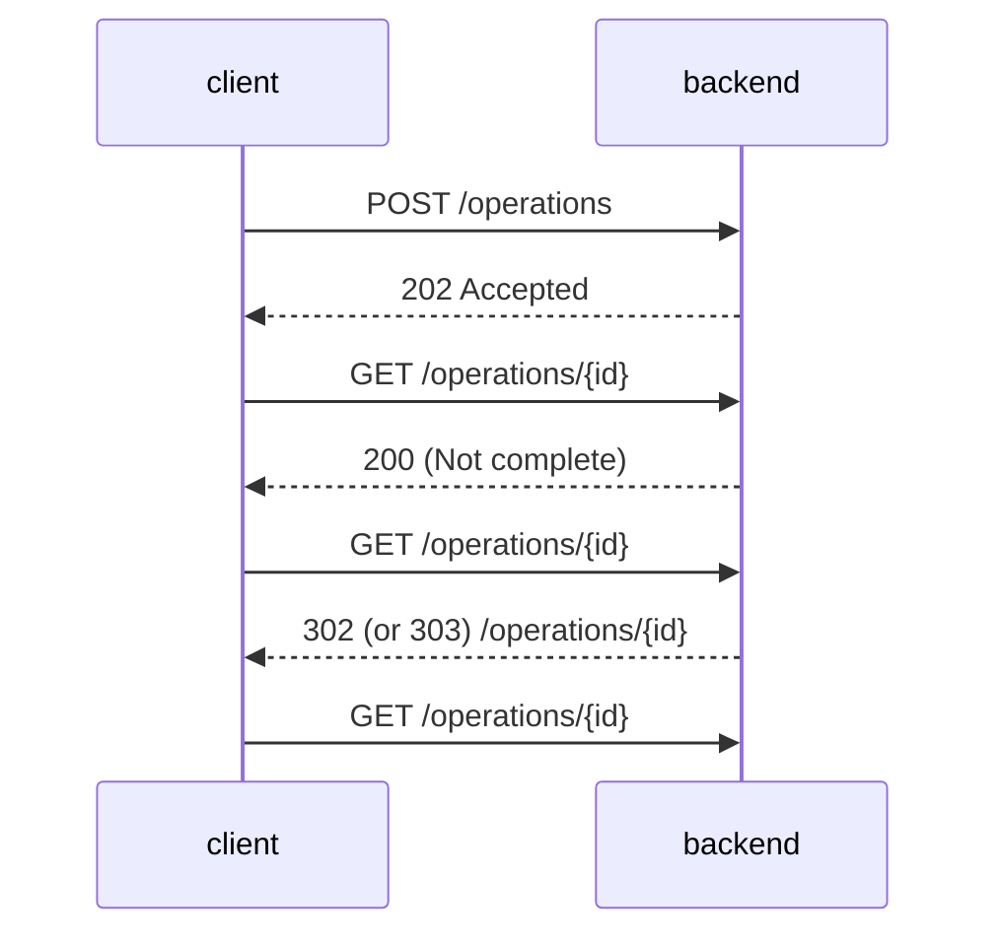
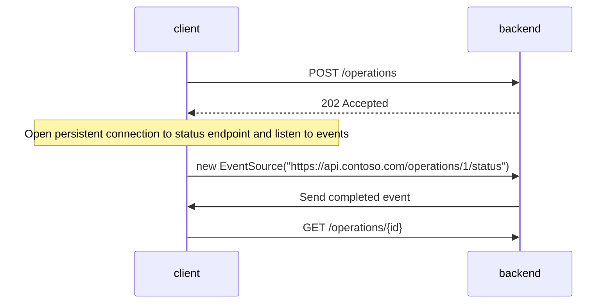

The asynchronous request reply pattern is useful in cases where an application has a client application running in a browser where the user starts an operation and is waiting for an immediate feedback and possibly a success notification. An issue arises only if the requested operation is long running, even a few seconds is unacceptable to return a feedback to a waiting user. [Microsoft has a nice documentation about this pattern](https://learn.microsoft.com/en-us/azure/architecture/patterns/async-request-reply) which essentially propose to have 3 endpoints:
- a POST endpoint to start the long running operation: `POST /operations`
- a GET endpoint to check for the status of the operation `GET /operations/{id}/status`
- a GET endpoint pointing to the created resource `GET /operations/{id}`

The actual path for the endpoints might vary and aren't explicitely provided in the Microsoft docs, I'm proposing those for the sake of the post, based on your requirements and the semantic of your API you might want have different ones. The interaction flow between the client and the backend is this one:



For example the `POST /operations` can return something like

```json
{
  "id":1,
  "links": [
    {
      "rel":"status_check",
      "href":"https://api.contoso.com/operations/1/status", 
      "action":"GET" 
    },
  ]
}
```

This flow works and has low complexity. Of course a client can execute a lot of retries in a short amount of time and Microsoft suggests to provide a `Retry-After` header that the client **should** honor and wait for the indicated time. This pattern has a clear use case with browser based clients but a platform with a low tech maturity can implement this pattern even with a machine to machine interaction. I would prefer to have webhooks in place if the interaction is machine to machine but this is not always possible and whether you are on the client side or backend side you might not be able to dictate technical solutions for the other part.

I think there is another approach to this pattern, for a browser client, that avoids having the polling on the endpoint and doesn't require websockets. If you have a dedicated [BFF](https://learn.microsoft.com/en-us/azure/architecture/patterns/backends-for-frontends) for a client app this might be the solution for you.

<!-- truncate -->

My proposal is based on 3 endpoints, like the Microsoft one, however the status endpoint is using Server-sent events to notify the frontend about the completion of the long running operation. At the time of writing [caniuse.com shows a 96.94% support](https://caniuse.com/eventsource) across browser and notes:

> Since January 2020, this feature works across the latest devices and major browser versions

So the Server-sent event feature is supported enough to be used, of course less supported than http requests, however it is a viable options if we want to avoid polling and other more complex solutions like websockets. Before choosing this path some other limitations need to be taken into account, for example the [mdn web docs show this warning ](https://developer.mozilla.org/en-US/docs/Web/API/Server-sent_events/Using_server-sent_events)

> Warning: When not used over HTTP/2, SSE suffers from a limitation to the maximum number of open connections, which can be especially painful when opening multiple tabs, as the limit is per browser and is set to a very low number (6). The issue has been marked as "Won't fix" in Chrome and Firefox. This limit is per browser + domain, which means that you can open 6 SSE connections across all of the tabs to www.example1.com and another 6 SSE connections to www.example2.com (per Stack Overflow). When using HTTP/2, the maximum number of simultaneous HTTP streams is negotiated between the server and the client (defaults to 100).

That said, ChatGPT UI is using server events to get the responses for the backend, just look at the network panel of the browser to see how it works.

<figure>
     
  <figcaption>The network panel of the browser showing the conversation request</figcaption>
</figure>

<figure>
     
    <figcaption>The event stream detail of the request</figcaption>
</figure>


If server-sent events are enough for ChatGPT they might be enough even for us. How do we use them to implement the asynchronous request reply pattern? We change the payload returned by the `POST /operations` to

```json
{
  "id":1,
  "links": [
    {
      "rel":"status_check",
      "href":"https://api.contoso.com/operations/1/status", 
      "action":"EventSource" 
    },
  ]
}
```

Almost the same as before, the `action` is now `EventSource` so that the client knowns what to do with the endpoint, this value is not standard (as far as I known) choose and document whatever makes sense for you and your team. On the frontend, instead of the polling code, what we have to do is this:

```javascript
const evtSource = new EventSource("https://api.contoso.com/operations/1/status");

evtSource.addEventListener("pending", (event) => {
    // handle pending
});

evtSource.addEventListener("completed", (event) => {
    // handle completed, shows notification/toast

    // close the connection
    evtSource.close();
});

evtSource.addEventListener("error", (event) => {
    // handle completed, shows notification/toast

     // close the connection
    evtSource.close();
});


```

I added samples for multiple events, at very least we need one to notify the completion of the operation. Since events can carry information in the `event.data` field the resource URI can be returned in the completed event payload. With this approach the interaction flow is the following:



I prepared a sample C# project with a simple html + javascript UI that shows a simple implementation of the three endpoints and how the frontend is receiving the updates and closing the connection when completed. The asynchronous work is represented by a Task that just waits before completing. The code is on [github](https://github.com/davidelettieri/asynchronous-request-reply-pattern).